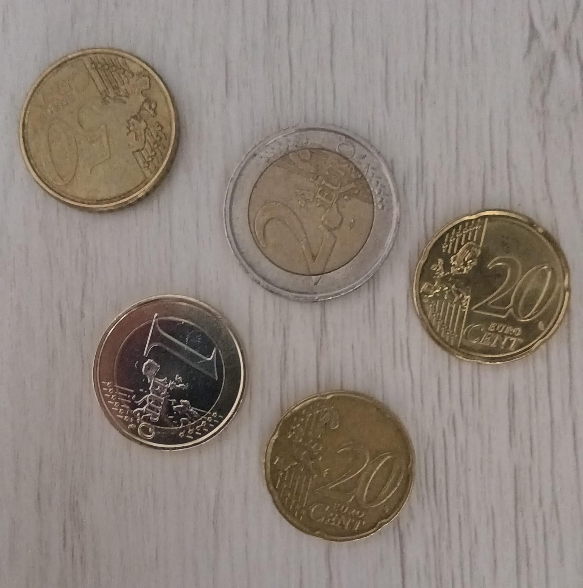
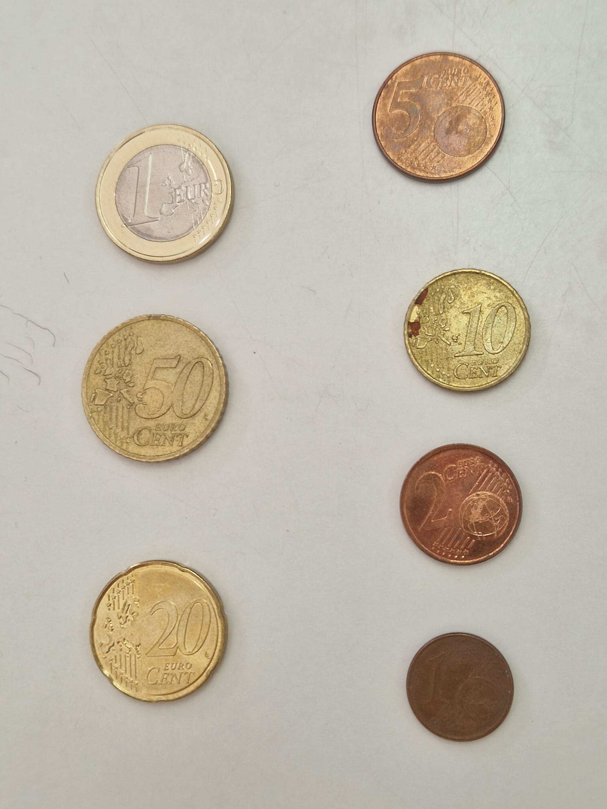

## Práctica 3. Detección y reconocimiento de formas

### Contenido

Ejercicios para detectar formas en imágenes.

- Caso de detección de monedas en imágenes ideales y reales.
- Caso de detección de microplásticos de tres tipos distintos: TAR, FRA y PEL.

**Librerías**

```py
# Ejercicio 1
import cv2
import numpy as np
import matplotlib.pyplot as plt

# Ejercicio 2
import cv2
import numpy as np # Cálculos matemáticos
import pandas as pd # Lectura de dependencias
from sklearn.ensemble import RandomForestClassifier # Modelo de Entrenamiento
from sklearn.metrics import confusion_matrix, classification_report # Matriz de confusión y datos
import matplotlib.pyplot as plt
import seaborn as sns # Analisis de métricas
import sys
```

### TAREA: Los ejemplos ilustrativos anteriores permiten saber el número de monedas presentes en la imagen. ¿Cómo saber la cantidad de dinero presente en ella? Sugerimos identificar de forma interactiva (por ejemplo haciendo clic en la imagen) una moneda de un valor determinado en la imagen (por ejemplo de 1€). Tras obtener esa información y las dimensiones en milímetros de las distintas monedas, realiza una propuesta para estimar la cantidad de dinero en la imagen. Muestra la cuenta de monedas y dinero sobre la imagen. No hay restricciones sobre utilizar medidas geométricas o de color.

### Una vez resuelto el reto con la imagen ideal proporcionada, captura una o varias imágenes con monedas. Aplica el mismo esquema, tras identificar la moneda del valor determinado, calcula el dinero presente en la imagen. ¿Funciona correctamente? ¿Se observan problemas?

### Nota: Para establecer la correspondencia entre píxeles y milímetros, comentar que la moneda de un euro tiene un diámetro de 23.25 mm. la de 50 céntimos de 24.35, la de 20 céntimos de 22.25, etc.

Extras: Considerar que la imagen pueda contener objetos que no son monedas y/o haya solape entre las monedas. Demo en vivo.

Primeramente para empezar el ejercicio necesitamos cargar las imagenes que vamos a usar para reconocer las monedas.
Usamos una función para redimensionar las imagenes que explicaremos más adelante.

```py
#  --- 1. Cargar imágenes ---
img = cv2.imread("Monedas.jpg")
img1 = cv2.imread("test_monedas1.jpg")
img1 = redimensionar_imagen(img1, ancho_max=800) # nueva imagen
img2 = cv2.imread("monedas3.jpg")
img2 = redimensionar_imagen(img2, ancho_max=800)
if img is None or img1 is None:
    raise IOError("No se pudieron cargar las imágenes.")
```

### Las imágenes cargadas son las siguientes:





Existen diferentes características en las diferentes imágenes.Alguna de ellas tienen el fondo en tono grisáceo, otra tiene una distancia más lejana a las monedas que puede influir en el tamaño. La que mejores resultados dará será la imagen ideal, que tiene una perfecta relación de diámetro entre las monedas. Esto permite diferenciar entre monedas. Además, el fondo blanco da un buen contraste para detectar las circunferencias.

A continuación se presenta la función usada para redimensioanr estas imágenes sin perder las condiciones:

```py
def redimensionar_imagen(img, ancho_max=800):
    alto, ancho = img.shape[:2]
    if ancho > ancho_max:
        escala = ancho_max / ancho
        nuevo_ancho = int(ancho * escala)
        nuevo_alto = int(alto * escala)
        img_redim = cv2.resize(img, (nuevo_ancho, nuevo_alto))
        return img_redim
    else:
        return img
```

Introduciendo una escala se ajusta el tamaño de la imagen para su correcta visualización.

### Encontrar las monedas

El siguiente paso sería encontrar las monedas que hay en la imagen para su medición. Para ello se ha declarado una función que según el evento de pulsación del click izquierdo del ratón, buscará monedas. Esto se consigue gracias al control de OpenCV.

```py
# Selección de la moneda de referencia
    ref_diametro_mm = 23.25
    escala_mm_px = None
    ref_pos = None

    def seleccionar_moneda(event, x, y, flags, param):
        nonlocal escala_mm_px, ref_pos, img_display
        if event == cv2.EVENT_LBUTTONDOWN:
            distancias = [np.sqrt((x - cx)**2 + (y - cy)**2) for (cx, cy, _) in circles[0, :]]
            idx = np.argmin(distancias)
            (cx, cy, r) = circles[0][idx]
            ref_pos = (cx, cy)
            diametro_ref_px = 2 * r
            escala_mm_px = ref_diametro_mm / diametro_ref_px
            print(f"Moneda de referencia seleccionada en ({cx}, {cy})")
            # resaltar la referencia
            img_display[:] = img.copy()
            for (x0, y0, r0) in circles[0, :]:
                cv2.circle(img_display, (x0, y0), r0, (0, 255, 0), 2)
            cv2.circle(img_display, (cx, cy), r, (0, 0, 255), 3)
```

`cv2.EVENT_LBUTTONDOWN` nos permite que cuando el usuario haga click en la imagen se busquen las monedas, en este caso, la moneda más cercana a donde clicó.

Se calcula la distancia euclidiana entre el punto clicado (x, y) y el centro de cada círculo detectado (cx, cy) **para cada círculo**. `circles[0, :]` proviene del resultado de `cv2.HoughCircles()`, que devuelve una lista de círculos detectados en la imagen. Explicamos el uso de esta función de OpenCV más adelante.

Esto nos da una lista de distancias entre el click y cada moneda detectada. Después usamos `np.argmin()` para determinar el índice de la moneda más cercana a donde el usuario hizo click.

Finalmente representamos sobre la imágen los contornos detectados.

### HoughCircles

```py
# Detectar monedas
    circles = cv2.HoughCircles(
        gray, cv2.HOUGH_GRADIENT, dp=1, minDist=50,
        param1=100, param2=45, minRadius=25, maxRadius=100
    )
```

Esta función usa la transformada de Hough para, a través de la imagen en grises, detectar círculos. Esto en esencia es un gradiente que teniendo la imagen procesada por Canny para encontrar bordes, verifica que se cumpla la ecuación del círculo para cada punto encontrado. En cada borde se calcula el ángulo del gradiente (entre más grande, mayor el cambio). Después de encontrar varios puntos y según los resultados obtenidos, se encontrará un punto que podría potencialmente ser un centro. Por ello, al ser una estimación es importante ajustar bien los parámetros:

- `dp`. Escala de resolución
- `minDist`. Distancia mínima entre centros que pueden ser detectados
- `param1`. Umbral Canny superior.
- `param2`. Umbral que controla restricción para detectar más o menos círculos
- `MinRadius/MaxRadius`. Rango de radios para detectar. Esto es, los tamaños que pueden llegar a tener las monedas.

Ajustar estos parámetros ha sido vital para la detección de monedas en el ejercicio.

### Cálculo del valor de las monedas

```py
cv2.namedWindow("Selecciona moneda de referencia")
cv2.setMouseCallback("Selecciona moneda de referencia", seleccionar_moneda)
while escala_mm_px is None:
    cv2.imshow("Selecciona moneda de referencia", img_display)
    if cv2.waitKey(1) & 0xFF == 27:
        break
cv2.destroyAllWindows()

if escala_mm_px is None:
    raise ValueError("No se seleccionó ninguna moneda de referencia.")
```

Usando la función anterior, podemos obtener por fin la escala de milímetros a píxeles que nos permitirá conocer el valor de las monedas según sus dimensiones.

```py

   monedas_info = {
        16.25: 0.01,
        18.75: 0.02,
        19.75: 0.10,
        21.25: 0.05,
        22.25: 0.20,
        23.25: 1.00,
        24.25: 0.50,
        25.75: 2.00
    }

    total = 0
    resultado = img.copy()

    for (x, y, r) in circles[0, :]:
        diametro_mm = 2 * r * escala_mm_px
        diametro_real = min(monedas_info.keys(), key=lambda d: abs(d - diametro_mm))
        valor = monedas_info[diametro_real]
        total += valor
        cv2.circle(resultado, (x, y), r, (0, 255, 0), 2)
        cv2.putText(resultado, f"{valor:.2f}EUR", (x - 25, y),
                    cv2.FONT_HERSHEY_SIMPLEX, 0.6, (255, 0, 0), 2)
    cv2.putText(resultado, f"Total: {total:.2f} EUR", (50, 50),
                cv2.FONT_HERSHEY_SIMPLEX, 1, (0, 0, 255), 3)

    return resultado, total
```

En esta parte final de la función `procesar_monedas()`, usamos un diccionario que contiene el valor de cada moneda como información del cálculo. Dentro de este bucle `for()`, para cada moneda detectada calculamos su valor buscando en el diccionario según el diámetro obtenido por los pasos anteriores. Sumamos todos los valores en una variable `total` y mostramos en una nueva imagen el resultado con el valor de cada círculo/moneda detectada usando `cv2.putText()`.

```py
resultado1, total1 = procesar_monedas(img)
resultado2, total2 = procesar_monedas(img1)
resultado3, total3 = procesar_monedas(img2)
```

Calculamos todos los pasos explicados anteriormente para las 3 imágenes de prueba.

### Muestra del resultado

```py

plt.figure(figsize=(20, 8))

plt.subplot(1, 3, 1)
plt.imshow(cv2.cvtColor(resultado1, cv2.COLOR_BGR2RGB))
plt.axis("off")
plt.title(f"Monedas.jpg\nTotal: {total1:.2f} EUR")

plt.subplot(1, 3, 2)
plt.imshow(cv2.cvtColor(resultado2, cv2.COLOR_BGR2RGB))
plt.axis("off")
plt.title(f"monedas2.jpg\nTotal: {total2:.2f} EUR")

plt.subplot(1, 3, 3)
plt.imshow(cv2.cvtColor(resultado3, cv2.COLOR_BGR2RGB))
plt.axis("off")
plt.title(f"monedas3.jpg\nTotal: {total3:.2f} EUR")

plt.show()

```

### TAREA: La tarea consiste en extraer características (geométricas y/o visuales) de las tres imágenes completas de partida, y _aprender_ patrones que permitan identificar las partículas en nuevas imágenes. Para ello se proporciona como imagen de test _MPs_test.jpg_ y sus correpondientes anotaciones _MPs_test_bbs.csv_ con la que deben obtener las métricas para su propuesta de clasificación de microplásticos, además de la matriz de confusión. La matriz de confusión permitirá mostrar para cada clase el número de muestras que se clasifican correctamente de dicha clase, y el número de muestras que se clasifican incorrectamente como perteneciente a una de las otras dos clases.
