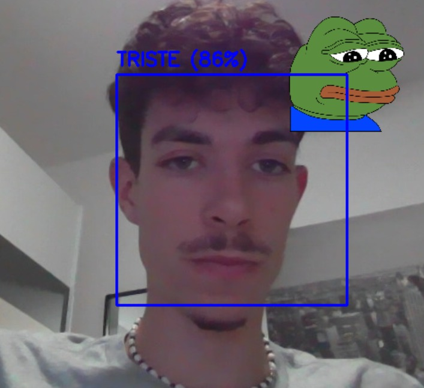
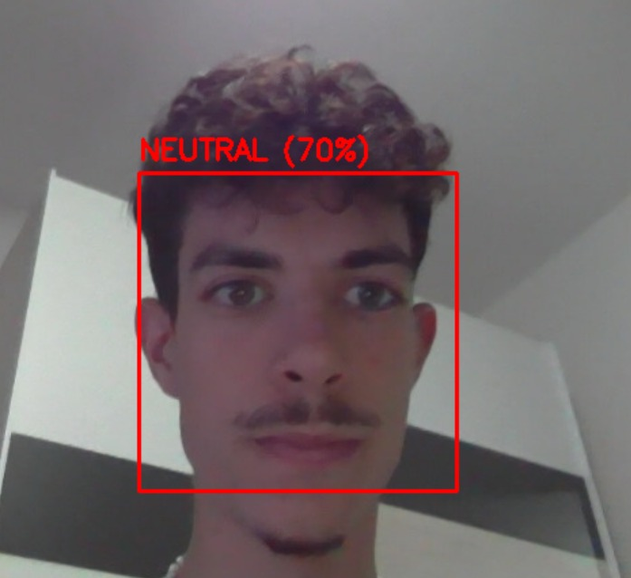
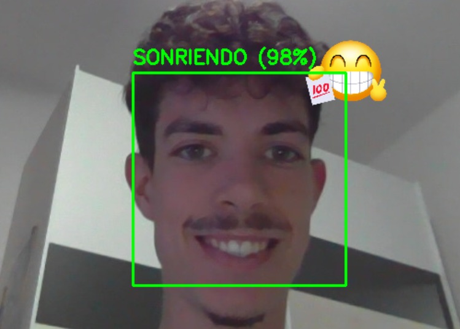

## Practica 5
Grupo 9

- David Suárez Martel
- Náyade García Torres

### Entrenamiento
En este proyecto, para realizar los prototipos deseados optamos por entrenar **SVM (Support Vector Machine)**. Para el desarrollo de este, se pasa información de imágenes escogidas de varios datasets de la plataforma [Kaggle](https://www.kaggle.com). Las cuales se pasan por una red neuronal, en concreto **VGG-Face**, para realizar la extracción de características.

Los datos se recorrerán dentro de la carpeta [data](./data), en la que se dividen tres subcarpetas con las emociones a detectar:
- Sonriendo
- Triste
- Neutral

Cargamos el detector de DeepFace para caras, además de las herramientas que nos otorgan las diferentes librerías. `scikit-learn` nos proporcionará el SVC, las métricas y los útiles para el entrenamiento.
```py
import os
import numpy as np
import joblib
from deepface import DeepFace
from sklearn.model_selection import train_test_split
from sklearn.svm import SVC
from sklearn.metrics import classification_report
from tqdm import tqdm

# Config 
DATA_DIR = "data"
CATEGORIES = ["neutral", "sonriendo", "triste"] # 0 = neutral, 1 = sonriendo, 2 = triste
MODEL_NAME = "VGG-Face"
MODEL_FILENAME = "smile_classifier.pkl"
CATEGORIES_FILENAME = "categories.pkl"

X = []
y = []

print(f"Iniciando entrenamiento")

```

Hemos definido las rutas a las imágenes e inicializado una lista para las características y otra para las etiquetas. Con esto ya podemos empezar a recorrer las imágenes, procesando cada categoría una a una.

Usando `DeepFace.represent()` se realiza la extracción.
Cada *embedding* es un vector numérico con las características de la cara una vez pasada por la red neuronal. 

```py
# Recorrer imágenes 
for i, category in enumerate(CATEGORIES):
    path = os.path.join(DATA_DIR, category)
    image_files = os.listdir(path)
    print(f"\nProcesando categoría: {category} ({len(image_files)} imágenes)")
    
    for img_name in tqdm(image_files):
        img_path = os.path.join(path, img_name)
        
        try:
            embedding_obj = DeepFace.represent(img_path=img_path, 
                                               model_name=MODEL_NAME, 
                                               enforce_detection=False)
            
            # embedding_obj es una lista, se toma el primero
            embedding_vector = embedding_obj[0]['embedding']
            
            X.append(embedding_vector)
            y.append(i) # 0 para neutral, 1 para sonriendo, 2 para triste
            
        except Exception as e:
            print(f"Error procesando {img_path}: {e}")

if not X:
    print("No se extrajo ninguna característica")
    exit()


# Convertir a arrays de numpy
X = np.array(X)
y = np.array(y)

```

Una vez extraídos los *embeddings* de las imágenes, habiéndolos guardado en nuestras lístas de características y anotaciones (asignando una categoría a cada una), podemos seguir al siguiente paso.  

Evaluaremos cómo de bueno llega a ser nuestro modelo SVC. Para ello realizamos un **split 80/20**, en el que:
- 80% de imágenes serán para **entrenar**
- 20% de imágenes serán para **probar**


```py

print(f"\nTotal de características extraídas: {X.shape}")
print(f"Total de etiquetas: {y.shape}")

# Evaluación
print("\nEvaluando modelo con split 80/20...")
X_train, X_test, y_train, y_test = train_test_split(X, y, test_size=0.2, random_state=42, stratify=y)

eval_model = SVC(kernel='linear', probability=True)
eval_model.fit(X_train, y_train)

y_pred = eval_model.predict(X_test)
print(classification_report(y_test, y_pred, target_names=CATEGORIES))

```

`eval_model.fit` entrenará el modelo temporal (80%)

`eval_model.predict(X_test)` predecir etiquetas que nunca ha visto (20%)

Finalmente mostraremos un `classification_report()` para mostrar los resultados. Se verá así:
```
Iniciando extracción de características con VGG-Face...

Procesando categoría: neutral (603 imágenes)
100%|██████████| 603/603 [02:43<00:00,  3.69it/s]

Procesando categoría: sonriendo (600 imágenes)
100%|██████████| 600/600 [04:54<00:00,  2.04it/s]

Procesando categoría: triste (599 imágenes)
100%|██████████| 599/599 [02:31<00:00,  3.96it/s]

Total de características extraídas: (1802, 4096)
Total de etiquetas: (1802,)

Evaluando modelo con split 80/20...
              precision    recall  f1-score   support

     neutral       0.89      0.97      0.93       121
   sonriendo       0.97      0.95      0.96       120
      triste       0.97      0.91      0.94       120

    accuracy                           0.94       361
   macro avg       0.94      0.94      0.94       361
weighted avg       0.94      0.94      0.94       361  
```

En los resultados de entrenamiento se puede comprobar que el modelo funcionará adecuadamente. Es bastante exacto y `weighted_avg` nos indica que funciona bien con todas las categorías en general. Detecta con especial precisión la *tristeza* y la *sonrisa*. Sin embargo, el bajo **recall** en la tristeza muestra que se le escaparán ciertas caras tristes.

**En conclusión:** El modelo será bastante fiable, detectará sonrisas perfectamente, pero a veces se confundirá levemente con tristeza y neutralidad. Es un curioso comportamiento similar al de los humanos cuando confundimos seriedad con tristeza.

```py


print("\nEntrenando modelo final")
final_model = SVC(kernel='linear', probability=True)
final_model.fit(X, y)

joblib.dump(final_model, MODEL_FILENAME)
joblib.dump(CATEGORIES, CATEGORIES_FILENAME)

print(f"\n Modelo guardado en '{MODEL_FILENAME}'")
print(f"Categorías disponibles: '{CATEGORIES_FILENAME}'")
```
Finalmente concluimos el entrenamiento y haciendo uso de `joblib` guardamos el modelo que hemos entrenado para su posterior uso.
```
Modelo guardado en 'smile_classifier.pkl'
Categorias disponibles: 'categories.pkl'
```
### Prototipo 1. Detector de emociones (Demo)

A partir del modelo entrenado anteriormente, se usará para realizar una demostración de su funcionamiento, en el que tendrá que detectar las emociones del usuario en la cámara.

A continuación se presentan ejemplos de salidas para distintas emociones:

*Tristeza*



*Neutral*



*Sonriendo*




Para comenzar necesitaremos las dependencias necesarias para la demo y configuraciones varias.

- `joblib`: Cargar el modelo.
- `cv2`: Manejar la demo con la cámara.
- `DeepFace`: Detección de las caras
- `numpy`: Operaciones

Además de estas librerías cargamos las imágenes a mostrar en la demo, el modelo detector de caras que usaremos y especificaremos la **confianza mínima** con la que se podrán detectar las caras.

```py
import cv2
import joblib
import numpy as np
from deepface import DeepFace

# Config 
MODEL_FILENAME = "smile_classifier.pkl"
CATEGORIES_FILENAME = "categories.pkl"
SAD_EMOJI_FILE = "pepo.png"
EMOJI_FILE = "happy_face.png"
MODEL_NAME = "VGG-Face" 
DETECTOR_BACKEND = "opencv" 
CONF_THRESHOLD = 0.70 

# Rendimiento
FRAME_SKIP_RATE = 5  # Analizar 1 de cada 5 fotogramas

```
La última línea le dice a la demo que el modelo solo analice 1 fotograma cada *N* fotogramas. Esto se implementa por cuestiones de rendimiento a la hora de realizar la demostración. Entre menos pasadas, más fluida debería ir la demostración.

A continuación, realizamos una función que permite superponer la imagen que corresponda seguún el estado de la persona. Es necesario **que la imagen tenga transparencia**, es decir, que tenga 4 canales.

Posteriormente cargamos los recursos necesarios y comenzamos con el procesamiento de imágen.
```py

# Función para superponer imágenes
def overlay_transparent(background_img, overlay_img, x, y):
    """ Superpone una imagen (con canal alfa) sobre otra. """
    try:
        bg_h, bg_w, _ = background_img.shape
        ol_h, ol_w, ol_c = overlay_img.shape

        if x < 0: x = 0
        if y < 0: y = 0
        if x + ol_w > bg_w: ol_w = bg_w - x
        if y + ol_h > bg_h: ol_h = bg_h - y

        overlay_img = overlay_img[0:ol_h, 0:ol_w]

        if ol_c == 4: # Si tiene canal alfa
            alpha_s = overlay_img[:, :, 3] / 255.0
            alpha_l = 1.0 - alpha_s
            roi = background_img[y:y+ol_h, x:x+ol_w]
            for c in range(0, 3):
                roi[:, :, c] = (alpha_s * overlay_img[:, :, c] +
                                alpha_l * roi[:, :, c])
            background_img[y:y+ol_h, x:x+ol_w] = roi
    except Exception as e:
        print(f"Error al superponer imagen: {e}")
    
    return background_img

# Carga de recursos 
try:
    model = joblib.load(MODEL_FILENAME)
    CATEGORIES = joblib.load(CATEGORIES_FILENAME)
except FileNotFoundError:
    print(f"Error: No se encontraron los archivos '{MODEL_FILENAME}' o '{CATEGORIES_FILENAME}'.")
    exit()

# Cargar emojis
try:
    emoji = cv2.imread(EMOJI_FILE, -1)
    if emoji is None: raise FileNotFoundError(EMOJI_FILE)
    sad_emoji = cv2.imread(SAD_EMOJI_FILE, -1)
    if sad_emoji is None: raise FileNotFoundError(SAD_EMOJI_FILE)
except FileNotFoundError as e:
    print(f"No se encontró el emoji")
    if str(e) == EMOJI_FILE:
         emoji = None
    if str(e) == SAD_EMOJI_FILE:
         sad_emoji = None

print("Pulsa 'q' para salir.")

cap = cv2.VideoCapture(0)

# Variables  
frame_count = 0
last_box = None 
last_label_name = "neutral"
last_confidence = 0.0
last_color = (0, 0, 255)

while True:
    ret, frame = cap.read()
    if not ret:
        break
    
    frame_count += 1
    
    # Búsqueda / análisis
    if frame_count % FRAME_SKIP_RATE == 0:
        try:
            embedding_objs = DeepFace.represent(frame,
                                                  model_name=MODEL_NAME,
                                                  detector_backend=DETECTOR_BACKEND,
                                                  enforce_detection=False)
            
            if len(embedding_objs) > 0:
                obj = embedding_objs[0]
                facial_area = obj['facial_area']
                
                # Guardar cara
                last_box = (facial_area['x'], facial_area['y'], facial_area['w'], facial_area['h'])
                
                embedding_vector = obj['embedding']
                prediction = model.predict([embedding_vector])
                proba = model.predict_proba([embedding_vector])
                label_index = prediction[0]
                
                last_label_name = CATEGORIES[label_index]
                last_confidence = proba[0][label_index]
                
                if last_label_name == "sonriendo" and last_confidence > CONF_THRESHOLD:
                    last_color = (0, 255, 0)
                elif last_label_name == "triste" and last_confidence > CONF_THRESHOLD:
                    last_color = (255, 0, 0)
                else:
                    last_color = (0, 0, 255)
            
            else:
                last_box = None

        except Exception as e:
            print(f"Error en el bucle de análisis: {e}")
            last_box = None

    
    # Renderizado
    if last_box is not None:
        x, y, w, h = last_box
        
        text = f"{last_label_name.upper()} ({last_confidence*100:.0f}%)"
        
        # Reacción 
        if last_label_name == "sonriendo" and last_confidence > CONF_THRESHOLD:
            if emoji is not None:
                emoji_size = w // 2
                resized_emoji = cv2.resize(emoji, (emoji_size, emoji_size))
                emoji_x = x + w - (emoji_size // 2)
                emoji_y = y - (emoji_size // 2)
                frame = overlay_transparent(frame, resized_emoji, emoji_x, emoji_y)

        elif last_label_name == "triste" and last_confidence > CONF_THRESHOLD:
            if sad_emoji is not None:
                emoji_size = w // 2
                resized_emoji = cv2.resize(sad_emoji, (emoji_size, emoji_size))
                emoji_x = x + w - (emoji_size // 2)
                emoji_y = y - (emoji_size // 2)
                frame = overlay_transparent(frame, resized_emoji, emoji_x, emoji_y)
        
        cv2.rectangle(frame, (x, y), (x+w, y+h), last_color, 2)
        cv2.putText(frame, text, (x, y - 10), cv2.FONT_HERSHEY_SIMPLEX, 0.7, last_color, 2)


    cv2.imshow("Detector de Sonrisas - 'q' para salir", frame)

    if cv2.waitKey(1) & 0xFF == ord('q'):
        break

cap.release()
cv2.destroyAllWindows()
```

```py
import cv2
import numpy as np
from deepface import DeepFace
from mtcnn import MTCNN
import random

# Imágenes
GLASSES_FILE = "swagger_glasses.png"
CHAR_FILE = "pepo.png"
CHAR_MALE_FILE = "bigote.png"   
CHAR_FEMALE_FILE = "lazo.png"
CHAR_SPY_FILE = "pepo_spy.png"

# Detecciones cada 15 fotogramas (motivos de rendimiento)
FRAME_SKIP_RATE = 15  

# Parámetros para ajustes de los efectos
CONF_THRESHOLD = 50
GLASSES_SPEED = 15
HEAD_TURN_THRESHOLD = 0.18

# Función de superposición de imágenes 
def overlay_transparent(bg, overlay, x, y, scale=1.0):
    try:
        if overlay is None:
            return bg
        
        h_overlay, w_overlay, c_overlay = overlay.shape
        new_w = int(w_overlay * scale)
        new_h = int(h_overlay * scale)

        if new_w <= 0 or new_h <= 0:
            return bg
            
        overlay = cv2.resize(overlay, (new_w, new_h), interpolation=cv2.INTER_AREA)
        h, w = new_h, new_w

        if c_overlay < 4:
            return bg

        rows, cols, _ = bg.shape
        y1, y2 = max(0, y), min(rows, y + h)
        x1, x2 = max(0, x), min(cols, x + w)

        y1o, y2o = max(0, -y), h - max(0, y + h - rows)
        x1o, x2o = max(0, -x), w - max(0, x + w - cols)

        if y1o < y2o and x1o < x2o:
            alpha = overlay[y1o:y2o, x1o:x2o, 3] / 255.0
            alpha_inv = 1.0 - alpha

            roi = bg[y1:y2, x1:x2]
            overlay_rgb = overlay[y1o:y2o, x1o:x2o, :3]

            for c in range(3):
                roi[:, :, c] = (alpha * overlay_rgb[:, :, c] +
                                alpha_inv * roi[:, :, c])
            
            bg[y1:y2, x1:x2] = roi

    except Exception as e:
        print(f"Error al superponer imagen: {e}")
    return bg

# Cargar Imágenes  
glasses = cv2.imread(GLASSES_FILE, -1)
character = cv2.imread(CHAR_FILE, -1)
char_male = cv2.imread(CHAR_MALE_FILE, -1)
char_female = cv2.imread(CHAR_FEMALE_FILE, -1)
char_spy = cv2.imread(CHAR_SPY_FILE, -1)

# Depuración 
if glasses is None: 
    print("No se encontró la imagen de gafas.")
if character is None: 
    print("No se encontró la imagen de personaje.")
if char_male is None or char_female is None:
    print("No se encontró el género. Saliendo.")
    exit()
if char_spy is None:
    print("No se encontró pepo_spy.png.")

# Cámara en vivo 
cap = cv2.VideoCapture(0)
if not cap.isOpened():
    print("No se encontró una fuente de vídeo.")
    exit()

print(" Meme Face Control Iniciado  — pulsa 'q' para salir.")

# Inicialización  
detector = MTCNN()

frame_count = 0
last_box = None
last_landmarks = None
last_dominant = "neutral"
last_gender = "Man"
glasses_pos = None

while True:
    ret, frame = cap.read()
    if not ret:
        break
    
    frame_count += 1
    
    # Detección de cara y landmarks en cada frame
    try:
        faces = detector.detect_faces(frame)
        if faces:
            face = faces[0]
            last_box = face['box']
            last_landmarks = face['keypoints']
        else:
            last_box = None
            last_landmarks = None
    except Exception as e:
        last_box = None
        last_landmarks = None
        print(f"Error MTCNN: {e}")
    
    if frame_count % FRAME_SKIP_RATE == 0 and last_box is not None:
        try:
            x, y, w, h = last_box
            if w > 0 and h > 0:
                face_img = frame[y:y+h, x:x+w]

                result = DeepFace.analyze(face_img,
                                          actions=['emotion', 'gender'],
                                          enforce_detection=False,
                                          detector_backend='skip')
                
                emotions = result[0]["emotion"]
                dominant = max(emotions, key=emotions.get)
                if emotions[dominant] < CONF_THRESHOLD:
                    last_dominant = "neutral"
                else:
                    last_dominant = dominant
                
                last_gender = result[0].get('dominant_gender',
                                            result[0].get('gender', 'Man'))

        except Exception as e:
            print(f"Error de análisis (DeepFace): {e}")

    # Render
    if last_box is not None:
        x, y, w, h = last_box
        

        if last_dominant == 'happy' and glasses is not None and last_landmarks:
            g_w = w
            g_h = int(glasses.shape[0] * (g_w / glasses.shape[1]))
            gx = x
            
            le_y = last_landmarks['left_eye'][1]
            re_y = last_landmarks['right_eye'][1]
            offset_vertical = - (h // 5) 
            target_y = (le_y + re_y) // 2 + offset_vertical

            if glasses_pos is None:
                glasses_pos = y - g_h

            if glasses_pos < target_y:
                glasses_pos += GLASSES_SPEED
                if glasses_pos > target_y:
                    glasses_pos = target_y

            frame = overlay_transparent(frame, glasses, gx, glasses_pos,
                                        scale=g_w / glasses.shape[1])
        else:
            glasses_pos = None

        # Si last_gender es Woman añade bigote, sino un lazo
        if last_dominant == 'surprise' and last_landmarks:
            if last_gender == 'Woman':
                nose_x, nose_y = last_landmarks['nose']
                scale = (w * 0.5) / char_male.shape[1]
                sw = int(char_male.shape[1] * scale)
                frame = overlay_transparent(frame, char_male,
                                            nose_x - sw // 2,
                                            nose_y,
                                            scale=scale)
            else:
                le_x, le_y = last_landmarks['left_eye']
                scale = (w * 0.4) / char_female.shape[1]
                sw = int(char_female.shape[1] * scale)
                sh = int(char_female.shape[0] * scale)
                frame = overlay_transparent(frame, char_female,
                                            le_x - sw // 2,
                                            le_y - sh - (h // 20),
                                            scale=scale)


        # Pepo espía
        if last_landmarks and char_spy is not None:
            le_x = last_landmarks['left_eye'][0]
            re_x = last_landmarks['right_eye'][0]
            nose_x = last_landmarks['nose'][0]

            eye_dist = re_x - le_x

            if eye_dist > 10:
                eye_center_x = (le_x + re_x) / 2
                turn_offset = nose_x - eye_center_x
                normalized_turn = turn_offset / eye_dist

                spy_scale = 0.25
                spy_h = frame.shape[0]
                spy_y = int(spy_h * 0.40)

                if normalized_turn > HEAD_TURN_THRESHOLD:
                    frame = overlay_transparent(frame, char_spy,
                                                0, spy_y, scale=spy_scale)

                elif normalized_turn < -HEAD_TURN_THRESHOLD:
                    flipped_spy = cv2.flip(char_spy, 1)
                    spy_w = int(flipped_spy.shape[1] * spy_scale)
                    frame = overlay_transparent(frame, flipped_spy,
                                                frame.shape[1] - spy_w,
                                                spy_y,
                                                scale=spy_scale)

    cv2.imshow("Face Meme Control - 'q' para salir", frame)
    if cv2.waitKey(1) & 0xFF == ord('q'):
        break

cap.release()
cv2.destroyAllWindows()
```

